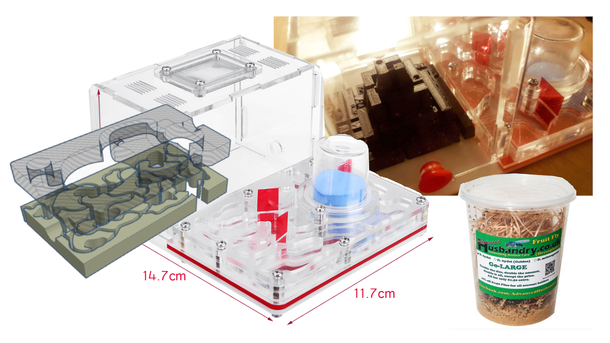

# FlyFarms

Kit for building, managing and imaging experimental 3D printed environments for model organisms like *Drosophila melanogaster*. Made in collaboration with the [3D Print Club](cheapjack.github.io/NMC3DPrintClub/) at the Neuromuscular Centre Winsford. Based on popular antfarm designs available on eBay.

Watch model organisms, the non-human collaborators of biomedicine on a [Critical Kits Twitch Stream](https://twitch.tv/CriticalKits)

Kit that explores the craft practices of the genetic experimental science of neuromuscular conditions with actors who are both the subjects and objects of the condition. Here practices of using Drosophila melanogaster models of Muscular Dystrophy (MD) are reproduced with another model of similarly 'flightless' fruit fly. This let's makers follow the practices of experimental biologists some of whom use 3D printing. Designing and using the kit with makers who share the bodily history that expresses the MD neuromuscular condition makes interesting differences. Comparing and caring-with other organisms makes a difference.
